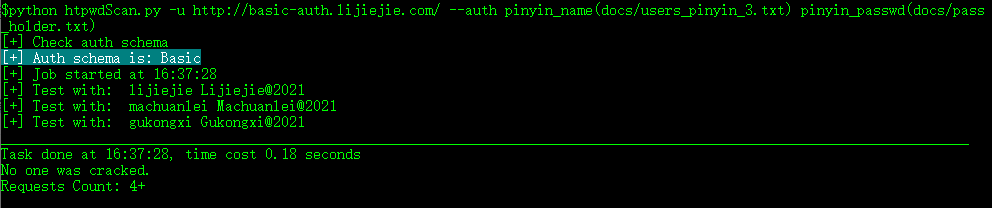

### 编写自定义函数处理参数值

参数的二次处理，可以用来破解一些密码策略较苛刻的场景，比如互联网企业的 Microsoft OWA

可用的函数都定义在 `lib/value_process.py` 中，用户可添加自定义函数。

函数接收2个参数：param_values 和 index

* 在Basic/Digest/NTLM认证时，传入的参数是一个列表['user', 'password'] ，以及索引0或1
* 在其他的模式下，传入的是一个字典{'login': 'Test_value', 'passwd': 'test_value'}， 以及当前参数的名称 login 或 passwd

下面示例，对三拼用户名生成字典

用户名字典内容：

```
li jie jie
ma chuan lei
gu kong xi
```

密码字典内容：

```
password_place_holder
```

编写函数处理用户名和密码

```
def pinyin_name(param_values, index):
    return param_values[index].replace(' ', '')


def pinyin_passwd(param_values, index):
    ret = param_values[0].split()
    return ret[0].capitalize() + ''.join(ret[1:]) + '@2021'
```

执行破解任务：

```
python htpwdScan.py -u http://basic-auth.lijiejie.com/ --auth pinyin_name(docs/users_pinyin_3.txt) pinyin_passwd(docs/pass_holder.txt)
```

可以观察到密码为我们的函数所生成



如果用户一开始对函数处理不熟悉，依然可以依赖外部工具生成字典，再导入破解。